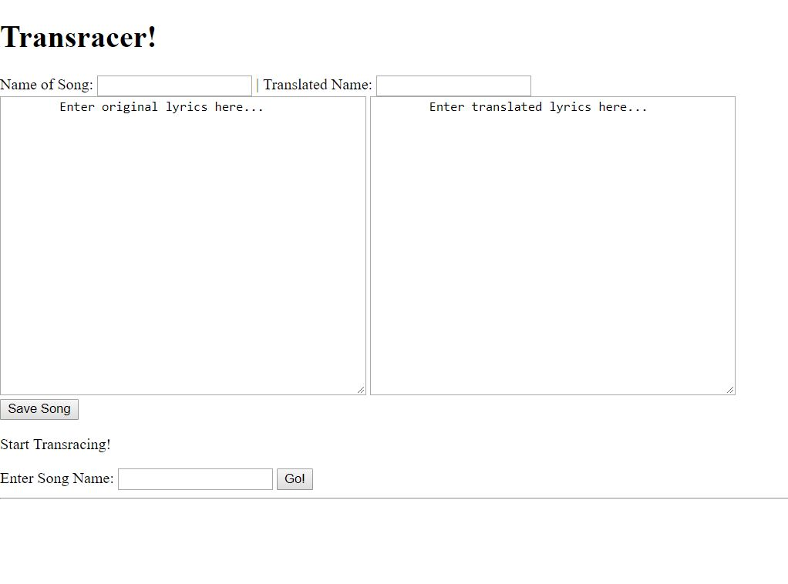

# Milestone 4
## Screenshots
### Main Page

### Improved UI Skeletons from milestone3.md
Our UI skeleton for this milestone is for the Translator-Lyric app. For the last milestone, we presented the UI for the Chat analyzer. 

Our current UI has the feature to translate a song to another language. You enter the original lyrics in the first box, and the translated lyrics in the other. The goal is to have the app tell user if their inputed translation is correct. 

### Our approach to addressing user privacy. 
For our app, we don't see user privacy being a huge issue. Some information we see our app storing and using would be results retrieved from an individuals interactions with the app (like, translation correctedness, or time spent using the app, etc). 