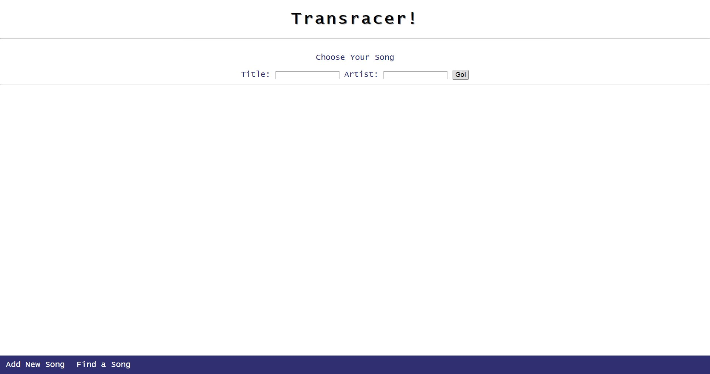

# Milestone 4
## Screenshots
*Add a Song*

*Transrace 1*

*Transrace 2*

## Description of how UI's been improved

The two main functions of the application (adding songs, transracing a song) are now separated into two pages. This is more clear than the previous design as it provides a much more clear flow to the functions of the site. The homepage, welcoming page is the "Add Song" page.

The overall application has undergone drastic HTML and CSS changes which add life and a more modern feeling. Gone is the 1980's website.

## 2 non-trivial actions

### Adding a song
To add a song, the user inputs a song's title, artist name, and an optional translation language in the corresponding fields. The user then inputs the lyrics in English in the left box, and the lyrics in another language in the right box. They hit "Save Song" to save the input into the database.

### Translating songs
To practice translating a song to another language, the user goes to "Find a Song". Here, the user inputs the title of the song and artist name in the corresponding boxes. They then click the "Go!" box. This will present the user with the English lyrics of the song they requested. The user must inally enter the translation in the "Enter Line" box, using the hint and check feature as necessary. 